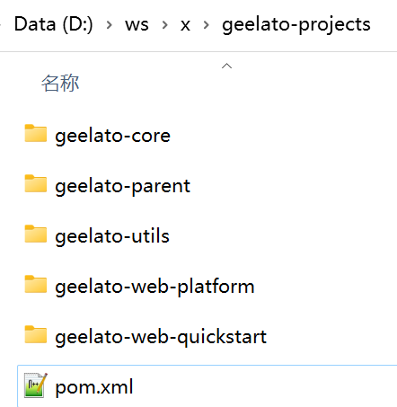

# 快速开始


## 环境准备 


运行环境Java19、Apache Maven 3.8.6、redis、mysql8、git。


## 创建项目

先在本地创建项目目录如geelato-projects，在该目录下创建pom.xml文件

```xml
<?xml version="1.0" encoding="UTF-8"?>
<project xmlns="http://maven.apache.org/POM/4.0.0"
         xmlns:xsi="http://www.w3.org/2001/XMLSchema-instance"
         xsi:schemaLocation="http://maven.apache.org/POM/4.0.0 http://maven.apache.org/xsd/maven-4.0.0.xsd">
    <modelVersion>4.0.0</modelVersion>

    <groupId>org.geelato</groupId>
    <artifactId>geelato-projects</artifactId>
    <packaging>pom</packaging>
    <version>1.0.0-SNAPSHOT</version>

    <modules>
        <module>geelato-core</module>
        <module>geelato-utils</module>
        <module>geelato-web-platform</module>
        <module>geelato-web-quickstart</module>
        <module>geelato-parent</module>
    </modules>
</project>
```


并从github上将以上几个项目（modules）clone下来，放在geelato-projects目录下。

```bash
D:\ws\x\geelato-projects-2>git clone git@github.com:geelato-projects/geelato-parent.git
Cloning into 'geelato-parent'...
remote: Enumerating objects: 44, done.
remote: Counting objects: 100% (6/6), done.
remote: Compressing objects: 100% (4/4), done.
remote: Total 44 (delta 2), reused 6 (delta 2), pack-reused 38
Receiving objects: 100% (44/44), 8.99 KiB | 8.99 MiB/s, done.
Resolving deltas: 100% (18/18), done.

D:\ws\x\geelato-projects>git clone git@github.com:geelato-projects/geelato-utils.git
Cloning into 'geelato-utils'...
remote: Enumerating objects: 55, done.
remote: Counting objects: 100% (10/10), done.
remote: Compressing objects: 100% (5/5), done.
remote: Total 55 (delta 0), reused 6 (delta 0), pack-reused 45
Receiving objects: 100% (55/55), 14.28 KiB | 2.04 MiB/s, done.
Resolving deltas: 100% (8/8), done.

D:\ws\x\geelato-projects>git clone git@github.com:geelato-projects/geelato-core.git
Cloning into 'geelato-core'...
remote: Enumerating objects: 837, done.
remote: Counting objects: 100% (244/244), done.
remote: Compressing objects: 100% (128/128), done.
Receiving objects: 100% (837/837), 201.08 KiB | 139.00 KiB/s, done.
Resolving deltas: 100% (345/345), done.
remote: Total 837 (delta 97), reused 186 (delta 57), pack-reused 593


D:\ws\x\geelato-projects>git clone git@github.com:geelato-projects/geelato-web-platform.git
Cloning into 'geelato-web-platform'...
remote: Enumerating objects: 966, done.
remote: Counting objects: 100% (461/461), done.
remote: Compressing objects: 100% (235/235), done.
remote: Total 966 (delta 156), reused 394 (delta 107), pack-reused 505Receiving objects:  84% (812/966), 180.01 KiB | 27Receiving objects:  96% (928/966), 180.01 KiB | 270.00 KiB/s
Receiving objects: 100% (966/966), 530.38 KiB | 614.00 KiB/s, done.
Resolving deltas: 100% (378/378), done.


D:\ws\x\geelato-projects>git clone git@github.com:geelato-projects/geelato-web-quickstart.git
Cloning into 'geelato-web-quickstart'...
remote: Enumerating objects: 222, done.
remote: Counting objects: 100% (104/104), done.
remote: Compressing objects: 100% (58/58), done.
remote: Total 222 (delta 26), reused 94 (delta 24), pack-reused 118Receiving objects:  82% (183/222), 396.01 KiB | 375.0Receiving objects: 100% (222/222), 398.80 KiB | 385.00 KiB/s, done.

Resolving deltas: 100% (58/58), done.
```

此时目录如下：



```bash
geelato-projects
-geelato-parent              # 所有子项目的依赖，统一依赖库版本
-geelato-core                # 核心库，提供orm、元数据等能力
-geelato-utils               # 工具库
-geelato-web-platform        # web应用的基础库，供web应用实例工程依赖
-geelato-web-quickstart      # 快速开始的示例，可以copy该示例更改项目名称形成自己的web应用
-pom.xml
```

## 运行示例

用自己的熟悉的IDE工具打开，找到geelato-web-quickstart/src/main/java/org/geelato/quickstart/QuickStartApplication右键Run或Debug.

这时会报如下的错误

##### Caused by: java.lang.reflect.InaccessibleObjectException: Unable to make field private final byte[] java.lang.String.value accessible: module java.base does not "opens java.lang" to unnamed module @740773a3

这时由于引用的j2cache不支持java17+导致的，需要如下图，添加VM options。

```
--add-opens
java.base/java.lang=ALL-UNNAMED
--add-opens
java.base/java.math=ALL-UNNAMED
--add-opens
java.base/java.util=ALL-UNNAMED
--add-opens
java.base/java.util.concurrent=ALL-UNNAMED
--add-opens
java.base/java.net=ALL-UNNAMED
--add-opens
java.base/java.text=ALL-UNNAMED
--add-opens
java.sql/java.sql=ALL-UNNAMED
-Dpolyglot.engine.WarnInterpreterOnly=false
```

添加以上参数，再重新运行

```bash
 _____           _       _          ______             _
|  __ \         | |     | |         | ___ \           | |
| |  \/ ___  ___| | __ _| |_  ___   | |_/ / ___   ___ | |_
| | __ / _ \/ _ \ |/ _` | __|/ _ \  | ___ \/ _ \ / _ \| __|
| |_\ \  __/  __/ | (_| | |_| (_) | | |_/ / (_) | (_) | |_
 \____/\___|\___|_|\__,_|\__|\___/  \____/ \___/ \___/ \__|
 :: Geelato Boot by geelato.org ::        (v1.0.2.SNAPSHOT)

[INFO ]02.660 o.g.w.q.QuickStartApplication 51- Starting QuickStartApplication using Java 19.0.1 with PID 6552 (D:\ws\x\geelato-projects\geelato-web-quickstart\target\classes started by 10881 in D:\ws\x\geelato-projects)
[INFO ]02.662 o.g.w.q.QuickStartApplication 630- No active profile set, falling back to 1 default profile: "default"
[WARN ]03.368 o.s.c.LocalVariableTableParameterNameDiscoverer 123- Using deprecated '-debug' fallback for parameter name resolution. Compile the affected code with '-parameters' instead or avoid its introspection: org.geelato.web.platform.boot.ShiroConfiguration
[WARN ]03.435 o.s.c.LocalVariableTableParameterNameDiscoverer 123- Using deprecated '-debug' fallback for parameter name resolution. Compile the affected code with '-parameters' instead or avoid its introspection: org.geelato.web.platform.boot.DataSourceConfiguration
[INFO ]03.480 org.geelato.core.meta.MetaManager 38- 解析内置的类包含注解interface org.geelato.core.meta.annotation.Entity的实体！！
[WARN ]03.682 n.s.e.config.CacheConfiguration 841- Cache 'null' is set to eternal but also has TTI/TTL set.  To avoid this warning, clean up the config removing conflicting values of eternal, TTI and TTL. Effective configuration for Cache 'null' will be eternal='true', timeToIdleSeconds='0', timeToLiveSeconds='0'.
[INFO ]03.700 o.a.s.cache.ehcache.EhCacheManager 158- Cache with name 'org.geelato.web.platform.m.security.service.ShiroDbRealm.authorizationCache' does not yet exist.  Creating now.
[INFO ]03.710 o.a.s.cache.ehcache.EhCacheManager 165- Added EhCache named [org.geelato.web.platform.m.security.service.ShiroDbRealm.authorizationCache]
[WARN ]04.080 n.o.j2cache.ehcache.EhCacheProvider3 119- Failed to read ehcache3.defaultHeapSize = null , use default 1000
[INFO ]04.613 o.a.s.cache.ehcache.EhCacheManager 158- Cache with name 'org.geelato.web.platform.m.security.service.ShiroDbRealm.authorizationCache.1' does not yet exist.  Creating now.
[INFO ]04.613 o.a.s.cache.ehcache.EhCacheManager 165- Added EhCache named [org.geelato.web.platform.m.security.service.ShiroDbRealm.authorizationCache.1]
[INFO ]05.237 o.g.w.q.QuickStartApplication 57- Started QuickStartApplication in 2.848 seconds (process running for 3.375)
[INFO ]05.238 o.g.w.q.QuickStartApplication 17- QuickStartApplication>run
[INFO ]05.238 o.g.w.platform.boot.BootApplication 73- [启动参数]：
[INFO ]05.239 o.g.w.platform.boot.BootApplication 74- [配置文件]：null
[INFO ]05.239 o.g.w.platform.boot.BootApplication 75- [启动应用]...ing
[INFO ]05.239 o.g.w.platform.boot.BootApplication 60- [操作系统]Windows 11
protocol:file pkgPath:/D:/ws/x/geelato-projects/geelato-web-quickstart/target/classes/org/geelato
protocol:file pkgPath:/D:/ws/x/geelato-projects/geelato-web-platform/target/classes/org/geelato
protocol:file pkgPath:/D:/ws/x/geelato-projects/geelato-utils/target/classes/org/geelato
protocol:file pkgPath:/D:/ws/x/geelato-projects/geelato-core/target/classes/org/geelato
[INFO ]05.280 o.g.w.platform.boot.BootApplication 150- 未收到重置数据库命令，跳过创建表结构、跳过初始化表数据。
[INFO ]05.400 o.g.w.platform.boot.BootApplication 79- [启动应用]...OK
```

