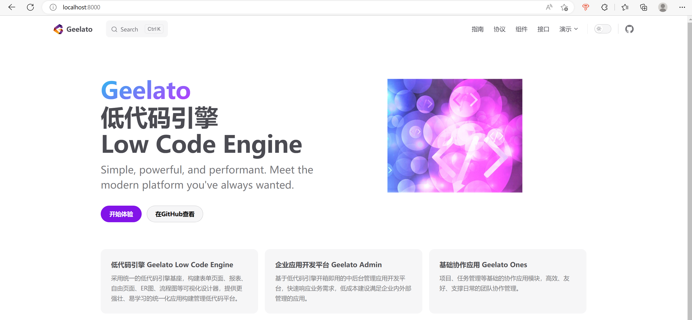

# 快速开始


## 环境准备

- pnpm v7.28.0+

- node v16.17.0+

- 设置国内npm镜像

  ```bash
  npm config set registry https://registry.npmmirror.com
  ```

  

## 项目创建

```bash
# 先更改CMD窗口编码
chcp 65001
```

先在本地创建项目目录如geelato-projects，假设项目的根目录为：D:\ws\x\geelato-projects。

```bash
# 进入该目录
cd D:\ws\x\geelato-projects
# clone项目
D:\ws\x\geelato-projects>git clone git@github.com:geelato-projects/geelato-front.git
Cloning into 'geelato-front'...
remote: Enumerating objects: 910, done.
remote: Counting objects: 100% (910/910), done.Receiving objects:   0% (1/910)
remote: Compressing objects: 100% (677/677), done.
remote: Total 910 (delta 128), reused 908 (delta 126), pack-reused 0
Receiving objects: 100% (910/910), 3.39 MiB | 2.29 MiB/s, done.
Resolving deltas: 100% (128/128), done.

# 安装依赖
D:\ws\x\geelato-projects\geelato-front>pnpm i

```

## 启动项目

```
D:\ws\x\geelato-projects\geelato-front\sites\gl-portal\pnpm docs:dev
```

启动后会看到文档站点




## 常见问题

### connect ETIMEDOUT 

如下，在通过pnpm i安装时，出现"‼ connect ETIMEDOUT "的情况，是因为在国内安装，网络不通的原因。

```
D:\ws\x\geelato-projects\geelato-front>pnpm i
Scope: all 9 workspace projects
webapps/gl-showcase-arco                 |  WARN  deprecated rollup-plugin-terser@7.0.2
webapps/gl-showcase-arco                 |  WARN  deprecated sourcemap-codec@1.4.8
webapps/gl-admin-arco                    |  WARN  deprecated stable@0.1.8
webapps/gl-admin-arco                    |  WARN  deprecated source-map-resolve@0.5.3
webapps/gl-admin-arco                    |  WARN  deprecated uuid@3.4.0
webapps/gl-admin-arco                    |  WARN  deprecated trim@0.0.1
webapps/gl-admin-arco                    |  WARN  deprecated resolve-url@0.2.1
webapps/gl-admin-arco                    |  WARN  deprecated source-map-url@0.4.1
webapps/gl-admin-arco                    |  WARN  deprecated urix@0.1.0
webapps/gl-admin-arco                    |  WARN  deprecated @types/vfile-message@2.0.0
Packages: +1364
++++++++++++++++++++++++++++++++++++++++++++++++++++++++++++++++++++++++++++++++++++++++++++++++++++++++++++++++++++++
Progress: resolved 1411, reused 1348, downloaded 0, added 0, done
node_modules/.pnpm/cwebp-bin@6.1.2/node_modules/cwebp-bin: Running postinstall script...
node_modules/.pnpm/gifsicle@5.2.0/node_modules/gifsicle: Running postinstall script, failed in 28.3s
.../gifsicle@5.2.0/node_modules/gifsicle postinstall$ node lib/install.js
│   ‼ connect ETIMEDOUT 151.101.76.133:443
│   ‼ gifsicle pre-build test failed
│   i compiling from source
│   × Error: Command failed: C:\WINDOWS\system32\cmd.exe /s /c "autoreconf -ivf"
│ 'autoreconf' is not recognized as an internal or external command,
│ operable program or batch file.
│     at D:\ws\x\geelato-projects\geelato-front\node_modules\.pnpm\execa@0.7.0\node_modules\execa\index.js:231:11
│     at runMicrotasks (<anonymous>)
│     at processTicksAndRejections (node:internal/process/task_queues:96:5)
│     at async Promise.all (index 0)
└─ Failed in 28.3s at D:\ws\x\geelato-projects\geelato-front\node_modules\.pnpm\gifsicle@5.2.0\node_modules\gifsicle
node_modules/.pnpm/jpegtran-bin@5.0.2/node_modules/jpegtran-bin: Running postinstall script...
node_modules/.pnpm/jpegtran-bin@6.0.1/node_modules/jpegtran-bin: Running postinstall script...
node_modules/.pnpm/mozjpeg@7.1.1/node_modules/mozjpeg: Running postinstall script...
 ELIFECYCLE  Command failed with exit code 1.
```

此时ping raw.githubusercontent.com，看是不是超时了，是的话，把下面的内容加到C:\Windows\System32\drivers\etc\hosts文件中

```
# github
199.232.4.133    raw.githubusercontent.com
```

```
# 再执行，
npm cache clean -f
# 再ping看是不是通了
ping raw.githubusercontent.com
```

再重新执行pnpm i安装

如果还是不成功，删除node_modules目录再试试

### Hostname/IP does not match certificate's altnames

```
# Hostname/IP does not match certificate's altnames
npm set strict-ssl false  
```


